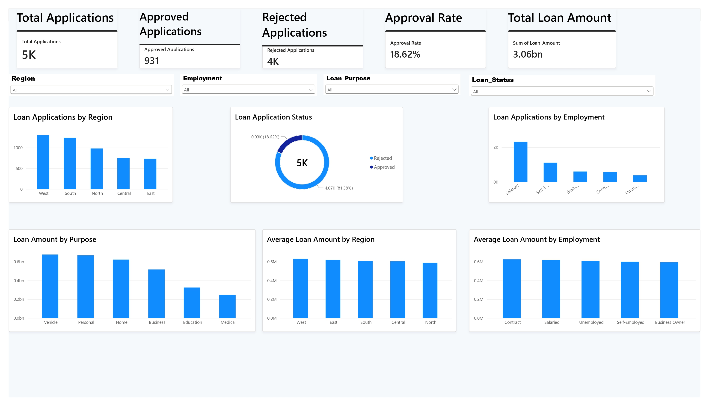
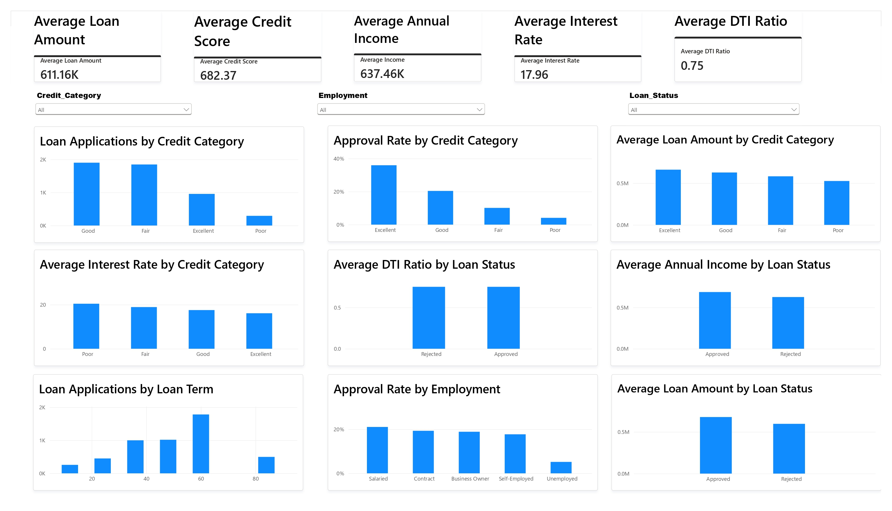

# loan-application-risk-analysis
Interactive Power BI dashboard for loan application, approval and risk analysis using SQL, Python, Excel and DAX.

# Loan Application & Risk Analysis Dashboard

An interactive Power BI dashboard designed to analyze loan
applications, approval performance, customer characteristics,
and lending trends.

## Tools & Technologies

- Power BI
- DAX
- SQL
- Python
- Excel

## Project Overview

This project analyzes loan application data to identify patterns
in application volume, approval performance, loan amounts,
customer characteristics, and risk indicators.

## Dashboard

### Page 1 — Loan Application Overview

### Page 2 — Loan Analysis

## Key Metrics

- Total Applications: 5,000
- Approved Applications: 931
- Rejected Applications: 4,069
- Approval Rate: 18.62%

## Analysis Areas

- Regional loan application trends
- Employment-based analysis
- Loan purpose analysis
- Credit category analysis
- Loan amount analysis
- Income analysis
- Interest rate analysis
- DTI ratio analysis
- Loan term analysis
- Approval performance

## Key Insights

...

## Project Structure

- `PowerBI/` — Power BI dashboard
- `screenshots/` — Dashboard screenshots
- `SQL/` — SQL analysis
- `Python/` — Exploratory analysis
- `data/` — Dataset
